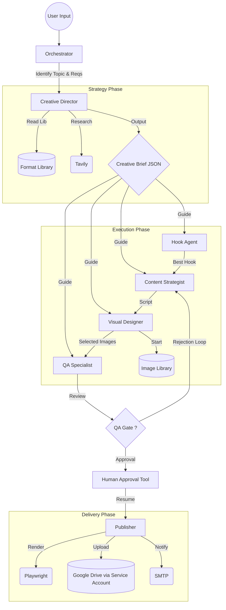

# TikTok Slideshow Agent: System Architecture (v2)

This document outlines the architecture of the revamped TikTok Slideshow Agent, which now features a **"Creative Director first"** workflow designed for high-viral potential.

## Core Philosophy
Unlike standard agents that jump straight to execution, this system mimics a high-end creative agency structure. **Strategy precedes Execution.**

1.  **Creative Brief as Source of Truth**: No agent moves until a unified "Creative Brief" defines the vision.
2.  **Format-Driven**: Content is not generic; it follows proven viral formats (e.g., "Transformation Story", "Myth-Busting").
3.  **Product Incidental**: The story leads; the product supports. This is key for TikTok native feel.

## Agent Workflow



## Specialist Roles (Updated)

### 1. Creative Director (Run 0)
*   **Role**: Top-level strategist.
*   **Action**: Analyzes the product, reads `format_library.json`, and outputs a **Creative Brief**.
*   **Key Output**: `narrative_arc` (beat-by-beat guide), `hook_style`, `image_arc`, `tone`.

### 2. Hook Agent (Run 1)
*   **Role**: Copywriter.
*   **Action**: Generates 5 hooks matching the *specific style* requested in the Brief (e.g., "First-Person Discovery").
*   **Constraint**: Must score > 8.5 on Viral Metric.

### 3. Content Strategist (Run 2)
*   **Role**: Scriptwriter & Logic Check.
*   **Action**: Writes the full script following the Brief's `narrative_arc`.
*   **New Feature**: **User Requirement Compliance** (Phase 0 Check) preventing constraint violations manually.

### 4. Visual Designer (Run 3)
*   **Role**: Art Director.
*   **Action**: Selects images that match the emotional beat of the `image_arc` (e.g., "Moody" -> "Bright").
*   **Source**: Local `image_library` mapped via `utils/sync_tool`.

### 5. QA Specialist (Run 4)
*   **Role**: Quality Control.
*   **Action**: Checks everything against the **Creative Brief** and **User Requirements**.
*   **Power**: Can reject work back to Strategist (Max 3 loops).
*   **Gate**: Calls `request_human_approval` to trigger the Human-in-the-Loop pause.

### 6. Publisher (Run 5)
*   **Role**: Delivery.
*   **Action**: Renders slides (HTML to Image), Uploads to Google Drive, Sends Email.

## Data Structures

### The Creative Brief
This is the JSON object passed to every agent.
```json
{
  "format_id": "transformation-story",
  "hook_style": "first-person-discovery",
  "narrative_arc": [
    {"slide": 1, "purpose": "hook", "guidance": "..."},
    {"slide": 2, "purpose": "problem", "guidance": "..."}
  ],
  "product_position": "incidental",
  "image_arc": ["moody", "transitional", "bright"],
  "user_requirements": ["Max 4 slides"]
}
```
