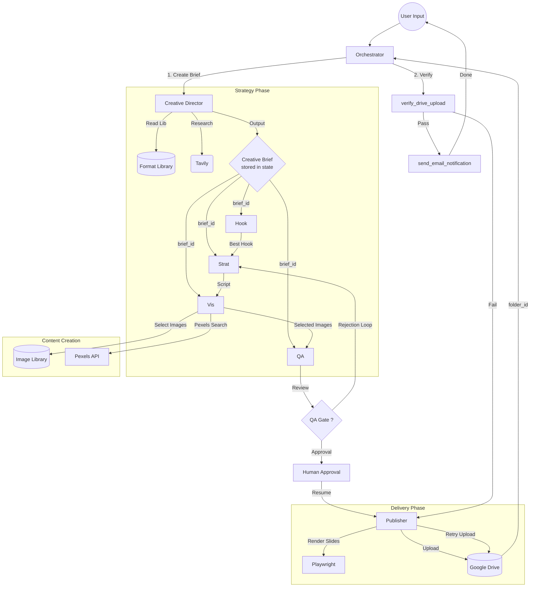

# TikTok Slideshow Agent: System Architecture (v3)

This document outlines the architecture of the TikTok Slideshow Agent, featuring a **"Creative Director First"** workflow designed for high-viral potential with comprehensive quality gates.

## Core Philosophy

Unlike standard agents that jump straight to execution, this system mimics a high-end creative agency structure. **Strategy precedes Execution.**

1.  **Creative Brief as Source of Truth**: No agent moves until a unified "Creative Brief" defines the vision.
2.  **Format-Driven**: Content is not generic; it follows proven viral formats (e.g., "Transformation Story", "Myth-Busting").
3.  **Product Incidental**: The story leads; the product supports. This is key for TikTok native feel.
4.  **Double Verification**: Orchestrator independently verifies Drive uploads before sending emails.

## Agent Workflow



## Skills System

The agent uses a skills-based architecture for context-efficient operations. Skills are located in `skills/` directory.

| Skill | Purpose |
|-------|---------|
| `creative-brief-manager` | Manages Creative Brief storage and retrieval via `brief_id` |
| `visual-designer-skill` | Image selection, Pexels integration, visual consistency |
| `publisher-skill` | Rendering, Drive upload, verification workflows |
| `orchestrator-workflow` | Agent coordination, verification, completion logic |
| `agent-task-formatter` | Standardized task formatting for sub-agents |

### How Skills Work

1. **Creative Brief Manager**: Stores briefs in `AgentState` and provides `get_brief_fields()` tool
2. Agents receive `brief_id` instead of full JSON (~90% context reduction)
3. Agents call `get_brief_fields(brief_id, ["field1", "field2"])` to get only what they need

## Agent Tool Assignments

### Orchestrator (Executive Producer)
**Role**: Coordinates all agents, performs final verification, sends emails.

| Tool | Purpose |
|------|---------|
| `verify_drive_upload` | Double-check Drive upload (metadata.json + slide order) |
| `send_email_notification` | Send completion email AFTER Orchestrator verification |

### Creative Director (Strategy)
**Role**: Creates the Creative Brief that guides all downstream agents.

| Tool | Purpose |
|------|---------|
| `read_format_library` | Read proven viral formats |
| `TavilySearch` | Research topic/product context |

### Hook Agent (Copywriting)
**Role**: Generates scroll-stopping hooks matching Brief's `hook_style`.

| Tool | Purpose |
|------|---------|
| `TavilySearch` | Research hook examples and patterns |
| `get_brief_fields` | Retrieve: `hooks`, `tone`, `target_audience`, `hook_style` |

### Content Strategist (Scriptwriting)
**Role**: Writes full script following Brief's `narrative_arc`.

| Tool | Purpose |
|------|---------|
| `get_brief_fields` | Retrieve: `narrative_arc`, `key_messaging`, `tone`, `product_position` |

### Visual Designer (Art Direction)
**Role**: Selects images matching the `image_arc`.

| Tool | Purpose |
|------|---------|
| `sync_image_library` | Refresh local image metadata |
| `search_pexels_with_fallback` | Search Pexels with auto-fallback queries |
| `verify_visual_consistency` | Check image consistency score |
| `select_best_fitting_image` | Pick best image from candidates |
| `get_brief_fields` | Retrieve: `image_arc`, `tone`, `format_id` |

### QA Specialist (Quality Control)
**Role**: Final check against Brief and User Requirements.

| Tool | Purpose |
|------|---------|
| `request_human_approval` | Pause for human review |
| `save_locally` | Save approved metadata.json |
| `get_brief_fields` | Retrieve: `slides`, `format_id`, `tone`, `user_requirements` |

### Publisher (Delivery)
**Role**: Renders slides, uploads to Drive, returns verification info.

| Tool | Purpose |
|------|---------|
| `setup_project_folder` | Create project structure and Drive folder |
| `read_metadata_file` | Read approved metadata.json |
| `render_slide` | Render HTML slide to PNG |
| `upload_to_drive` | Upload all files (slides + metadata.json) |
| `verify_drive_upload` | Verify upload (slides + metadata.json) |

**Note**: Publisher does NOT send emails. Orchestrator handles email after its own verification.

## The Creative Brief (Updated Pattern)

### Old Pattern (Context Bloated)
```python
task(agent="hook-agent", task="Generate hooks. Creative Brief: {...2000 chars...}")
```

### New Pattern (Context Efficient)
```python
task(agent="hook-agent", task="Generate hooks. brief_id: brief_20260123_abc123")
# Agent calls:
get_brief_fields("brief_20260123_abc123", ["hooks", "tone", "target_audience"])
# Returns: {"hooks": [...], "tone": "energetic", "target_audience": "..."} (~200 chars)
```

### Brief Structure
```json
{
  "format_id": "transformation-story",
  "tone": "energetic",
  "topic_focus": "fitness motivation",
  "target_audience": "young professionals",
  "key_messaging": ["Transform your body", "Build lasting habits"],
  "hooks": {"style": "first-person-discovery", "reference": [...]},
  "narrative_arc": [
    {"slide": 1, "purpose": "hook", "guidance": "..."},
    {"slide": 2, "purpose": "problem", "guidance": "..."},
    {"slide": 3, "purpose": "discovery", "guidance": "..."},
    {"slide": 4, "purpose": "transformation", "guidance": "..."},
    {"slide": 5, "purpose": "cta", "guidance": "..."}
  ],
  "image_arc": {
    "type": "progressive",
    "notes": "moody → moody → transitional → bright → bright"
  },
  "product_position": "incidental",
  "cta_style": "engagement_first"
}
```

## State Management

```python
class AgentState(TypedDict):
    # Input
    topic: str
    project_id: str
    
    # Config
    slide_count: int
    tone: str
    font_style: str
    require_human_review: bool
    user_requirements: List[str]
    
    # Creative Brief (NEW - stored once, referenced by brief_id)
    creative_brief: Dict[str, Any]
    brief_id: str
    
    # Working Memory
    generated_hooks: List[str]
    selected_hook: str
    slides: List[Slide]
    
    # Planning
    todos: Annotated[List[Dict[str, Any]], merge_todos]
    
    # Output
    drive_folder_link: str
    logs: Annotated[List[str], operator.add]
```

## 2-Step Verification Workflow

### Step 1: Publisher Upload & Verify
1. Render all slides
2. Upload ALL files in ONE call: slides + metadata.json
3. Publisher calls `verify_drive_upload` to check
4. Returns `folder_name`, `folder_id`, `drive_link`, `verification` to Orchestrator

### Step 2: Orchestrator Double-Verification (NEW)
1. Orchestrator receives Publisher result
2. Orchestrator calls `verify_drive_upload` independently
   - Checks: metadata.json exists at root
   - Checks: slide_1.png through slide_N.png all present
   - Checks: No missing slides, no duplicates
3. If verification PASSES:
   - Orchestrator calls `send_email_notification`
   - Reports success to user with Drive link
4. If verification FAILS:
   - Orchestrator delegates back to Publisher with error
   - Publisher retries upload

## Email Flow

| Before | After |
|--------|-------|
| Publisher sends email immediately after upload | Orchestrator sends email AFTER its own verification |
| No independent verification | Double-verification (Publisher + Orchestrator) |
| Errors missed | Clear error reporting with retry loop |

## Pexels Tool Consolidation

| Tool | Status | Purpose |
|------|--------|---------|
| `search_pexels` | REMOVED | Basic search (deprecated) |
| `search_pexels_with_fallback` | ACTIVE | Auto-fallback + retry + slide_position optimization |

The consolidated tool:
- Automatically tries fallback queries if primary search yields insufficient results
- Auto-appends "no people background" for slides 2+ (Single Protagonist Rule)
- Includes retry logic with exponential backoff

## Quality Gates

### QA Specialist Checks
1. **User Requirement Compliance**: Slide count, forbidden words
2. **Creative Brief Compliance**: Hook style, narrative arc, product positioning
3. **Visual Consistency**: Image arc progression
4. **Creative Evaluation**: 0-10 score

### Orchestrator Verification Checks
1. **metadata.json present** at Drive folder root
2. **Correct slide naming**: slide_1.png through slide_N.png
3. **No missing slides**: All expected slides present
4. **No duplicates**: Each slide number appears once
5. **No extra files**: Only expected slides + metadata.json

## Key Files

| File | Purpose |
|------|---------|
| `agent.py` | Main entry point, agent/subagent definitions |
| `state.py` | `AgentState` schema |
| `tools/agent_tools.py` | Core tools (render, upload, verify, email) |
| `tools/drive.py` | Google Drive integration |
| `tools/pexels_handler.py` | Pexels API with fallback |
| `prompts/orchestrator.py` | Orchestrator instructions |
| `prompts/specialists.py` | All specialist prompts |
| `skills/*/scripts/` | Skill implementations |
| `format_library.json` | Proven viral formats |
| `knowledge_base.json` | Historical record |

## Error Handling

### Retry Loops
- **Content rejections**: Max 3 loops (QA → Strategist)
- **Upload failures**: Orchestrator sends back to Publisher with error

### Silent Failures Eliminated
- `upload_to_drive` now logs: ✅ uploaded, ❌ failed, ⚠️ skipped
- `verify_drive_upload` shows all files in folder when checks fail
